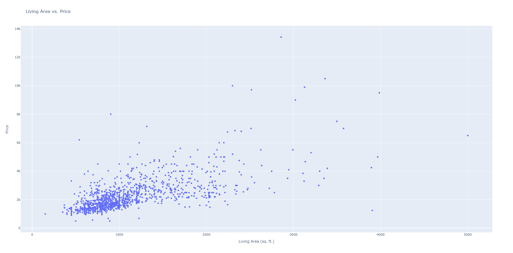

# Analysis of Apartments' Rent Prices in Austin, TX! (Especially for UT Students)

## a. Data Collection and Cleaning
 

* Here is the link to the API we used to retrieve price data(https://rapidapi.com/apimaker/api/zillow-com1). 

* For a query conducted around 17:08 Mon Oct 9, 2023, this yielded approximately 2800 unique listings with no empty values in the column of important features we listed in the 'Code/get_zillowData.py'. The home type we chose is apartments for rent in Austin, TX. See the detailed setting of the parameters in the code mentioned above. 

* To execute the code and get the cleaned result.csv file (the data file that you can use for further analysis), you should run the following codes from the terminal in order: 

>> git clone [github SSH]

>> cd eco395m-project1-midterm

>> cd Code  

>> pip install -r requirements.txt

>> python3 get_zillowData.py

You will get 6 CSV files named 'data_0, ..., data_5' that contain data for the first/second/.../sixth home type respectively. Also, you will get a CSV file named 'pre_result.csv', which combines the 6 CSV files above. Finally, you will get a CSV file named 'result.csv', which is the final result of our data collection and cleaning.  

**Caution! An error called 'KeyError: 'props'' may happen when you execute 'get_zillowData.py'. This is because of the unstableness of the API. You can run the code again until you can find a 'result.csv' file in your artifacts folder. We are really sorry for this, but sometimes the unstableness may occur for some API, hope you can understand, thanks!** 

   
A successful execution of the code will last about 4 minutes since we set up a sleep function for each loop to avoid reaching the request limit of the API. 

There is a hidden .env file in the root directory and the /code directory with API keys for both the Google Maps and Zillow API. If you are receiving errors please reach out to me at joewlimms1221@gmail.com and I will share the API keys with you as they are under a paywall.

The attributes that we have added are distance to university and zip_code, for instances where the address provided in the query did not yield a zip code.  These were both added using the Google leapis API and the code can be referenced in the get_lat_lon.py and get_zipcode.py files.  

You will get a CSV file for each type of home, and also a final result.csv containing the data of all types of homes.

To see data pre-cleaning and added attributes see 'pre_data.csv' in the 'artifacts' dir..  There are also page counts and observation counts from the APU query.  If you are wondering why attributes such as LivingArea and RentEstimate are missing, check that file to verify it is not included.  It may be possible to hard code some of those values using the provided link to the Zillow listing.  In the case that Zip is missing, it may be a failure from the get_zipcode.py file. However, the success rate for that query is relatively high.   

You can view the interactive Plotly plot for the following figures by downloading the .html file in the 'images' folder, for example, [here](images/LA_P_scatter_plot.html).

  

