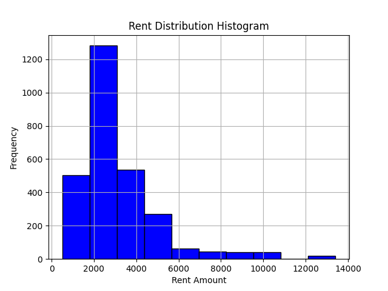
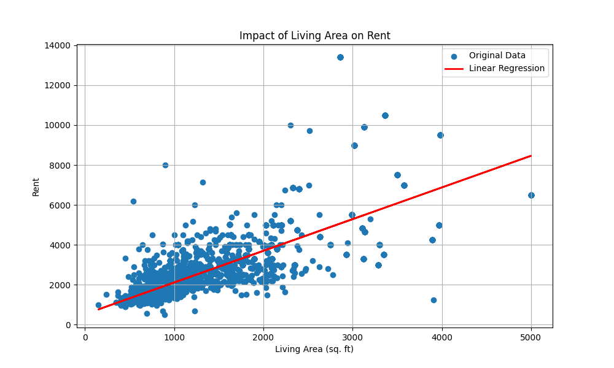
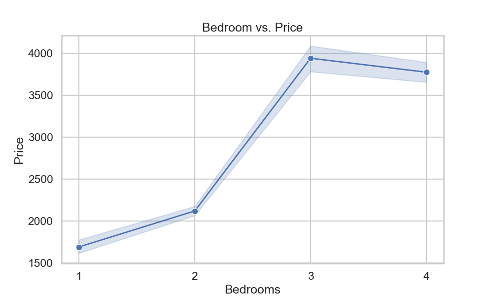
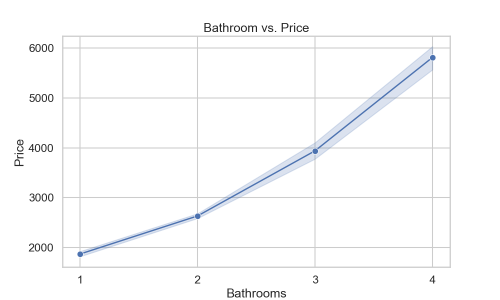
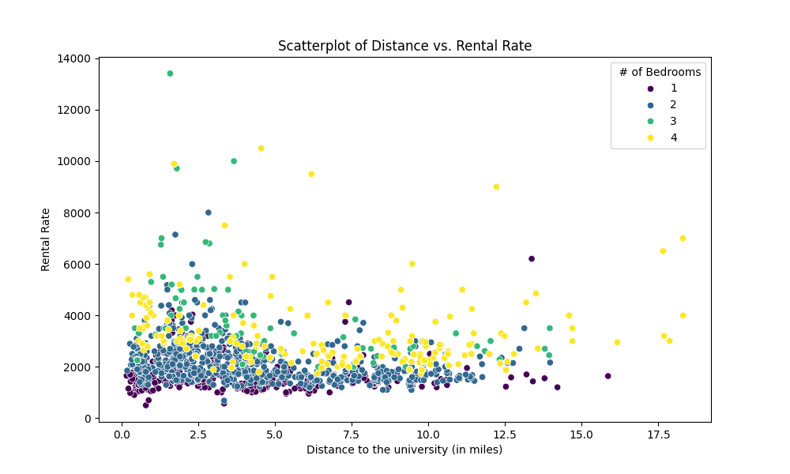
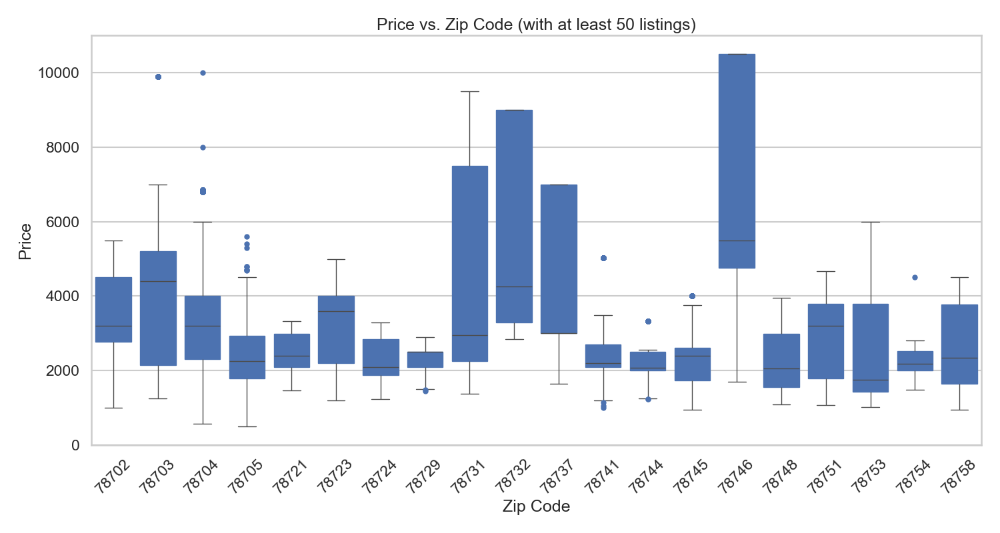
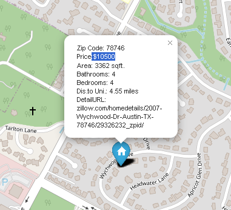
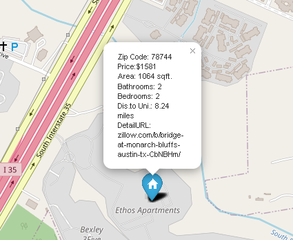
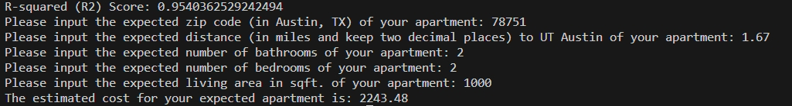

# Analysis of Apartments' Rent Prices in Austin, TX! (Support for User Interaction, Especially for UT Students)


## A. Data Collection and Cleaning
 
***Source:*** Here is the link to the API we used to retrieve data (https://rapidapi.com/apimaker/api/zillow-com1). 

For a query conducted around 18:20 Mon Oct 9, 2023, this yielded approximately 2800 unique listings with no empty values in the column of important features we listed in the 'Code/get_zillowData.py'. The home type we chose is apartments for rent in Austin, TX. See the detailed setting of the parameters in the code mentioned above.

***Data Attributes' Selection:***
We chose 'Price', 'Latitude', 'Longitude', 'Address', 'Bathrooms', and 'Bedrooms' as our features. They can be retrieved by setting parameters in the 'initial_pull' function of 'get_zillowData.py', which means we can get those attributes directly from the API.

Also, there are some attributes that we computed and added to the dataset, which are 'Distance to University' and 'zip_code', for instances where the address provided in the query did not yield a zip code. These were both added using the Google leapis API and the code can be referenced in the get_lat_lon.py and get_zipcode.py files.


***Execution method:*** To execute the code and get the cleaned result.csv file (the data file that you can use for further analysis), you should run the following codes from the terminal in order, remember to update the pip to the latest version to avoid errors, also you could change pip to pip3 in the third line, and python3 to python in the fourth line if you have trouble running the commands below. This is due to the difference between our environment.  


```python  

git clone git@github.com:josephwms/eco395m-project1-midterm.git 

cd eco395m-project1-midterm

pip install -r requirements.txt

python3 Code/data/get_zillowData.py  

``` 
***Results you will get:***
* 6 CSV files named 'data_0, ... , data_5' that contain data for the first/second/.../sixth home type respectively.
* A CSV file named 'pre_result.csv', which combines the 6 CSV files above but contains some empty values in it.
* A CSV file named **'result.csv'**,[here](artifacts/result.csv) which is the **final result** of our data collection and cleaning.  
 
   
***Things to Mention:***
 
* A successful execution of the code will last about **6-7 minutes** since we set up a sleep function for each loop to avoid reaching the request limit of the API, please wait for the execution a little bit patiently. 


* There is a hidden .env file in the root directory and the /code directory with API keys for both the Google Maps and Zillow API. If you are receiving errors please reach out to me at **joewlimms1221@gmail.com** and I will share the API keys with you as they are under a paywall.


* If you are wondering why an attribute such as LivingArea is missing for some rows, the reason is that not every house for rent provides such an attribute publicly. Therefore, we may not get some attributes and will receive a CSV file with some missing values. That's why we need to clean the data. In the case that Zip is missing, it may be a failure from the get_zipcode.py file. However, the success rate for that query is relatively high. We will get the final CSV file under several trials.


## B. Data overview

* We use Python to visualize the data overview and relationship between prices and other attributes, you can use the execution method below to get the following figures in the 'images' folder.

```python

python3 Code/analysis/analysis.py

```
* ***Documentation***
Price: The present monthly rental price of the apartments, measured in dollars;
Zip: The Zipcode of the rental apartment;  
My university: University of Texas, at Austin
Distance to University: The distance from the apartment to UT, measured in miles;
Address: The location of the apartment;
Bathrooms: Number of bathrooms in the apartment;
Bedrooms: Number of bedrooms in the apartment;
LivingArea: The Area of the apartment, measured in square feet;
Latitude: The latitude of the apartment;
Longitude: The longitude of the apartment;
DetailURL: The URL of the apartment shown in Zillow.

* ***Dataset Overview***
We start our analysis by seeing the distribution of rent. 



As shown in the plot above, rent varies from as low as around $800 to as high as around $13000. 

Next, we try to see the impact of different factors on rent.

* ***Relation between rent and other attributes***

The living area seems to have a positive relationship with rent i.e. as the living area increases so does the rent. We want to analyze how strong this relationship is so we try to fit a line to the plot as follows: 



This results in an intercept of 523.7376500423748 and a Coefficient for living area of 1.5875577468760047 which confirms the relationship to be positive. To see how much variation in rents is explained by living area we calculated its R-squared and found it to be around 50%. 
The correlation between rent and living area turned out to be 0.71 which confirmed a strong positive relationship. 

All these calculations were done using Python and are in the analysis.py file.

Next, we analyze the relationship between rent and the number of bedrooms. 



This gives us an interesting insight that as the number of bedrooms increases so does the rent but only till bedroom # 3. For bedroom 4, rent actually goes down. 

For bathrooms, on the other hand, the relationship with rent is such that as the number of bathrooms increases, the rent keeps on increasing. 



Another important factor has been the distance to the university. As UT Austin students, we thought, that analyzing the relationship between distance from the university and rent would be helpful to many. Also, the location of the university is quite central and near downtown, so we wanted to see its impact on rents. 



The plot surprisingly does not show a strong relationship between distance from the university and the rents. However, it does show that a lot of two bedrooms are clustered around the university and the majority of them are priced around $1500 to $2000. Another key insight was that 4 bedrooms on average seemed to be priced higher closer to the university than away from the university (ignoring some outliers) and this is well-explained by the fact that roommates share apartments closer to the university, driving rents up while away from the university 4 bedrooms are maybe not much in demand due to smaller families, in general, in the US and therefore in Austin. 

 

Here we gave each zipcode(with at least 50 listings) a boxplot. The most expensive rent on average was in the zipcode 78641 ($6443) which is the Westlake Hills suburb of Austin that has extremely high property value on average. On the other hand, 78744 had the lowest average rent ($2257). This can be attributed to the lower median property value of the area. Depending on the area in which the rental property is located can significantly impact the rent.  


***A visualization Map***

* We built a map for visualizing all the attributes of an apartment for rent.

* Users can click on the blue house marker on the map to have a brief understanding of the house rent and other attributes in a geographical way. It can give users a more comprehensive and clear view of the apartments for rent in Austin.

* To view this map, please click [here](images/rent_price_map.html) and **downloading the .html file**. Then open it locally, and you can enjoy finding information in it.


* Here are some screenshots from the map to illustrate some examples from our findings above:



  


* If you want to run our codes to get this map for our or your dataset, please follow the command line below:

```python

python3 Code/visualization/get_price_map.py

```


## C. Model and Result

***Goals:*** To build a regression model to predict a house rent for apartments in Austin, TX given several attributes such as 'Zip Code', 'Living Area', 'Bathrooms', etc.

***Variables:*** We chose 'Zip', 'LivingArea', 'Bathrooms', 'Bedrooms', and 'Distance to the University' as X, and chose 'Price' as Y for our regression models. 

***Model Selection:*** We tried several models, including parametric and non-parametric approaches. For machine learning methods, we conduct Random Forest(RF), Decision Tree(DT), and Support Vector Machines(SVM) methods. For regression models, we conduct Linear Regression(LR), Ridge Regression(RR), Bayesian Ridge Regression(BRR), Logistic Regression(LOG), and Polynomial Regression(PR) models.

***Model Comparison:*** We computed several model selection metrics to evaluate all eight models, including R Square, Adjusted R Squared, Mean Squared Error(MSE), Akaike Information Criterion(AIC), and Bayesian Information Criterion(BIC). After comparison, we found that the Random Forest model gives us the best result, and we will use it to conduct further prediction analysis.  

|  Model  |  R Squared  |  Adjusted R Squared  |  Mean Squared Error  |  AIC  |  BIC  |
|  ----  |  ----  |  ----  |  ----  |  ----  |  ----  |
| ***Random Forest*** | ***0.95411*** | **0.95370** | **179888.57504** | **6786.05203** | **6814.01965** |
| Decision Tree | 0.91308 | 0.91230 | 340709.73486 | 7143.72026 | 7171.68788 |
| Support Vector Machines | 0.71980 | 0.71726 | 1098409.01001 | 7799.24907 | 7827.21669 |
| Linear Regression | 0.65062 | 0.64746 | 1369569.77771 | 17762.41477 | 17790.38239 |
| Ridge Regression | 0.65056 | 0.64740 | 1369809.914018 | 7922.90222 | 7950.86984 |
| Bayesian Ridge Regression | 0.65048 | 0.64733 | 1370095.52937 | 7923.01897 | 7950.98659 |
| Logistic Regression | 0.75819 | 0.75601 | 947874.10893 | 7716.70711 | 7744.67473 |
| Polynomial Regression | 0.78914 | 0.76566 | 826570.17528 | 7742.02246 | 7990.71485 |

    
  
***Execution Method:***  


```python
python3 Code/models/Random_Forest_regression.py
```

* After you run this code in your terminal, you will see 6 model evaluation metrics of the model printed in the terminal. The R-Square Score is around 0.954 for our Random Forest Model, which is really accurate.

* You can use similar command lines to get results of other regression methods listed in the chart above, remember to change the name of the Python file to the method you'd like to use.

***User Interactions:***
Our codes have a section for user interactions, after you see the printed R-Square score, you will find that your expected values of the attributes we used are required by our code in the terminal, please follow the instructions given in the 'Code/RT_train.py' to input your expected Zip, Living Area, number of bathrooms, etc. If you follow the instructions correctly, you will get a printed result that contains the estimated rent of your expected apartment. Below is an example result.



## F. Reproducibility

* ***Data:*** The users can directly get their data by executing the same command lines as mentioned in the data collection part above. Mention that you will need an APIKEY for both RapidAPI.com and Google leapis API. You can get your own Google Leapis API by following some instructions online, but for RapidAPI.com, you need to sign up for an account to have your own APIKEY or ask for help by sending an email to **joewlimms1221@gmail.com**.

  
* ***Model:*** After you get your result.csv file, you can use the command lines shown in the second part to get an estimated price result.

  
* ***Analysis:*** You can get figures of the same format as ours by using the command lines shown in the third part, and all the figures and .html files will be kept in the folder called 'images'. 
  
  


## G. Limitations

* ***Data Collection:***  
 Our project's primary data source was the Zillow API which is a comprehensive platform. However, it does not encapsulate the entirety of available rental listings. A significant portion of properties not listed on Zillow were omitted from our analysis.  We also omitted a significant number of listings that did not include a value for 'Living Area,'- a potential sampling bias.
   
  Furthermore, we recognize that several influential factors went unaccounted for in our model. The furnishing status of a property, its age, available amenities such as swimming pools or gyms, security features, and specific landlord policies are all crucial determinants of rental pricing.
  
  Finally, the ever-changing nature of the rental market poses another limitation. The data we collected represents only a specific moment in time. As the rental landscape evolves, this snapshot might lose its relevance, making our model less reflective of future conditions.

* ***Modelling:***  
We tried eight methods for modeling and picked out the best one with the highest R Square Score. However, we didn't do enough work on the feature selection and parameter setting part. One could get a more accurate estimation if one used some metrics to delete some idle attributes or used grid search to find better parameters.

* ***Availablity:***  
Our research is only restricted to Austin and the university refers to the University of Texas, at Austin. If you want to research other cities, you can change the parameters in API, and if you want to change the colleges, you should edit the code in the file called get_lat_lon.py and get_zipcode.py. In this way, you are able to investigate the renting market around universities in the US.


  
## H. Further Improvements
It is crucial to continue researching the improvement of distance metrics. Using the interaction function, you are able to estimate the rent of your desired apartment and compare it to the prices listed on the renting websites. In this way, you are able to make price comparisons in several ways and pick the most efficient one.  
Our first statistics lead us to believe that the 'distance to university' has little bearing on rental rates. However, because the university is close to the city center, these two measurements may have overlapping effects. It is crucial to distinguish between the specific effects of being close to the institution and the more general attractiveness of being located downtown.  
We can also further refine the distance metric to better fit our model by introducing variables such as public transportation commute times or walkability indices. Additionally, our model might also be improved by using APIs to incorporate further variables, some of which were noted in our limitations section.  
Finally, we acknowledge the dynamic nature of rental markets. So, integrating a time series analysis is crucial to maintaining the correctness of our model and enables us to quickly adjust to markets or economies that are experiencing sharp volatility.


